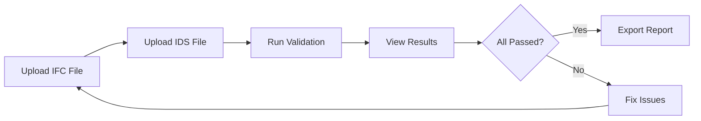

<div align="center">

# 🏗️ Simple IFC Content Viewer

### *A lightweight, standalone web-based IFC file viewer and analyzer*

[](https://www.python.org/)
[](https://flask.palletsprojects.com/)
[](http://ifcopenshell.org/)
[](./LICENSE)

[](https://github.com/MohamedShaabanAhmed/Simple_IFC_Content_Viewer)
[](https://github.com/MohamedShaabanAhmed/Simple_IFC_Content_Viewer/issues)

---

### 📋 View • ✅ Validate • 🔧 Correct • 💾 Export

*Zero configuration. Just run and analyze your IFC files.*

[Features](#-features) • [Quick Start](#-quick-start) • [Usage](#-usage) • [API](#-api-endpoints) • [Contributing](#-contributing)

</div>

---

## ⚠️ Project Status

> **🚧 This project is currently under active development**
> 
> - Core features are stable and working
> - New features are being added regularly
> - Bug reports and feature requests are welcome
> - Breaking changes may occur between versions

---

## 🌟 Features

<table>
<tr>
<td width="50%">

### 📊 **Comprehensive Analysis**
- ✅ Project statistics & summaries
- ✅ Element classification & counting
- ✅ Building storey breakdown
- ✅ Spatial hierarchy visualization
- ✅ Property sets extraction
- ✅ Quantities aggregation

</td>
<td width="50%">

### 🔍 **IDS Validation**
- ✅ Information Delivery Specification support
- ✅ Detailed validation reports
- ✅ Pass/Fail status tracking
- ✅ Missing property identification
- ✅ Compliance checking
- ✅ Requirement verification

</td>
</tr>
<tr>
<td width="50%">

### 🔧 **Header Corrections**
- ✅ Organization information
- ✅ Project metadata
- ✅ Building details
- ✅ Site information
- ✅ Author attribution
- ✅ Export corrected files

</td>
<td width="50%">

### 💾 **Export Capabilities**
- ✅ Download corrected IFC files
- ✅ Export to CSV/Excel
- ✅ Element data extraction
- ✅ Quantities summary
- ✅ Validation reports
- ✅ Property sets export

</td>
</tr>
</table>

---

## 🎨 Screenshots

### 📊 Dashboard Overview
```
┌─────────────────────────────────────────────────────────────┐
│  🏗️ IFC Toolkit - Standalone Version                       │
│  Professional IFC File Analysis Tool                        │
├─────────────────────────────────────────────────────────────┤
│                                                             │
│   📁 Upload IFC File                                        │
│   ┌───────────────────────────────────────────────────┐   │
│   │  Drag & drop your IFC file here or click browse  │   │
│   └───────────────────────────────────────────────────┘   │
│                                                             │
│   ✅ Apply Header Corrections                              │
│   Automatically correct organization, project details      │
│                                                             │
└─────────────────────────────────────────────────────────────┘
```

### 📈 Analysis Results
```
┌──────────────┬──────────────┬──────────────┬──────────────┐
│ 📊 Summary   │ 🌲 Elements  │ 📏 Quantities│ ✅ Corrections│
└──────────────┴──────────────┴──────────────┴──────────────┘

  Total Elements: 1,234      Element Classes: 45
  Building Storeys: 8        Buildings: 2

  Elements by Class:
  ┌─────────────────────┬───────┐
  │ IfcWall             │  234  │
  │ IfcSlab             │  156  │
  │ IfcColumn           │  89   │
  │ IfcBeam             │  167  │
  └─────────────────────┴───────┘
```

### 🔍 IDS Validation
```
┌─────────────────────────────────────────────────────────────┐
│  🔍 IDS Validation Results                                  │
├─────────────────────────────────────────────────────────────┤
│  Pass Rate: 85% ████████████████░░░░                        │
│                                                             │
│  ✅ Passed: 17 specifications                               │
│  ❌ Failed: 3 specifications                                │
│                                                             │
│  Detailed Report:                                           │
│  ✅ Wall Fire Rating - All elements compliant              │
│  ✅ Structural Properties - Requirements met                │
│  ❌ Thermal Properties - 12 elements missing values        │
└─────────────────────────────────────────────────────────────┘
```

---

## 🚀 Quick Start

### Prerequisites

```bash
# Required
Python 3.11 or higher
pip (Python package manager)

# Optional
Git (for cloning repository)
```

### Installation

**Option 1: Clone from GitHub**
```bash
git clone https://github.com/MohamedShaabanAhmed/Simple_IFC_Content_Viewer.git
cd Simple_IFC_Content_Viewer
```

**Option 2: Download ZIP**
- Download the repository as ZIP
- Extract to your preferred location
- Navigate to the folder

### Install Dependencies

```bash
pip install -r requirements.txt
```

**Manual Installation (if needed):**
```bash
pip install ifcopenshell flask flask-cors
```

### Run the Application

```bash
python ifc_standalone.py
```

### Open in Browser

```
🌐 http://localhost:8080
```

**That's it! 🎉 No complex setup, no configuration files.**

---

## 💡 Usage

### 1️⃣ Upload Your IFC File

**Supported Formats:**
- `.ifc` - Industry Foundation Classes
- `.ifcxml` - IFC XML Schema

**File Size:**
- Maximum: 500 MB
- Recommended: < 100 MB for optimal performance

**Upload Methods:**
- 🖱️ Drag & drop directly into the upload zone
- 📁 Click "Choose File" to browse
- Files are processed in-memory (secure & fast)

---

### 2️⃣ Apply Header Corrections *(Optional)*

<table>
<tr><th>Before</th><th>After Correction</th></tr>
<tr>
<td>

```
Organization Name: ABC Co.
Building ID: Building1
Site Code: Site_01
```

</td>
<td>

```
Organization Name: Subcontractor Full Name
Building ID: H2 Primary Asset
Site Code: H2 Bridge Building, Railings...
```

</td>
</tr>
</table>

**Corrections Applied:**
- ✅ Organization Name → Standardized format
- ✅ Organization Description → Primary Asset Name
- ✅ Author → Subcontractor ID
- ✅ Building ID → Project-specific format
- ✅ Site Code → Detailed location info
- ✅ Project Status → Complete work description
- ✅ Client Name → Primary Group
- ✅ Project Name → Standardized naming
- ✅ Project Phase → Construction stage
- ✅ Project Address → Full address details
- ✅ Project Number → Reference number

---

### 3️⃣ View Analysis Results

Navigate through **5 interactive tabs:**

#### 📊 **Summary Tab**
- Project statistics
- Element counts by class
- Building storey breakdown
- Spatial distribution

#### 🌲 **Elements Tab**
- Detailed grid of all elements
- Sortable & filterable table
- Element properties
- Quantities per element
- Export to CSV/Excel

#### 📏 **Quantities Tab**
- Aggregated quantities by class
- Volume calculations (m³)
- Area measurements (m²)
- Length totals (m)
- Count summaries

#### ✅ **Corrections Tab**
- View applied corrections
- Old vs. New values comparison
- Download corrected IFC file
- Correction summary report

#### 🔍 **IDS Validation Tab**
- Upload IDS specification file
- Run compliance checks
- View detailed validation report
- Pass/Fail status per specification
- Missing property identification

---

### 4️⃣ IDS Validation Workflow



**Steps:**
1. Upload your IFC file (original or corrected)
2. Upload IDS specification file (`.ids` or `.xml`)
3. Click "🔍 Run IDS Validation"
4. Review detailed pass/fail report
5. Identify non-compliant elements
6. Make corrections as needed

---

### 5️⃣ Export Options

**Available Exports:**

| Export Type | Format | Content |
|-------------|--------|---------|
| 💾 Corrected IFC | `.ifc` | IFC file with applied corrections |
| 📊 Elements Data | `.csv` | All elements with properties |
| 📈 Quantities | `.csv` | Aggregated quantities by class |
| ✅ Validation Report | `.html` | IDS validation results |

---

## 📁 Project Structure

```
Simple_IFC_Content_Viewer/
│
├── 📄 ifc_standalone.py          # Main application (single file!)
├── 📘 README.md                  # This file
├── 📜 LICENSE                    # MIT License
├── 📋 requirements.txt           # Python dependencies
├── 🔧 .gitignore                 # Git ignore rules
└── 📖 GITHUB_INSTRUCTIONS.md     # Deployment guide
```

**Why Single File?**
- ✅ Easy deployment
- ✅ Simple maintenance
- ✅ Quick understanding
- ✅ Portable across systems
- ✅ No complex dependencies

---

## 🛠️ Technical Details

### Built With

<table>
<tr>
<td align="center" width="25%">
<br/>
<b>Python 3.11+</b><br/>
Backend Logic
</td>
<td align="center" width="25%">
<br/>
<b>Flask 3.0+</b><br/>
Web Framework
</td>
<td align="center" width="25%">
<br/>
<b>IfcOpenShell</b><br/>
IFC Processing
</td>
<td align="center" width="25%">
<b>HTML/CSS/JS</b><br/>
Frontend UI
</td>
</tr>
</table>

### Architecture

```
┌─────────────────────────────────────────────────────────────┐
│                     Web Browser (Client)                    │
│  HTML UI • JavaScript • CSS Styling • AJAX Requests        │
└────────────────────────┬────────────────────────────────────┘
                         │ HTTP/JSON
┌────────────────────────▼────────────────────────────────────┐
│                   Flask Web Server (API)                    │
│  /api/analyze • /api/validate • /api/export                │
└────────────────────────┬────────────────────────────────────┘
                         │
┌────────────────────────▼────────────────────────────────────┐
│                  IfcOpenShell Engine                        │
│  IFC Parsing • Element Extraction • Validation             │
└─────────────────────────────────────────────────────────────┘
```

### Key Features

- **In-Memory Processing**: No permanent file storage
- **RESTful API**: Clean, well-documented endpoints
- **Responsive UI**: Works on desktop & tablets
- **Real-Time Validation**: Instant feedback
- **Temporary File Cleanup**: Automatic resource management
- **CORS Enabled**: Cross-origin request support

---

## 📋 API Endpoints

### `POST /api/analyze`

Analyze IFC file and return comprehensive element data.

**Request:**
```bash
curl -X POST http://localhost:8080/api/analyze \
  -F "file=@model.ifc" \
  -F "correctHeaders=true"
```

**Response:**
```json
{
  "success": true,
  "elements": [...],
  "corrections": [...],
  "fileId": "uuid-string",
  "summary": {
    "totalElements": 1234,
    "uniqueClasses": 45,
    "uniqueStoreys": 8,
    "uniqueBuildings": 2,
    "byClass": {...},
    "byStorey": {...}
  }
}
```

---

### `GET /api/export/<file_id>`

Download corrected IFC file.

**Request:**
```bash
curl -O http://localhost:8080/api/export/abc-123-def
```

**Response:**
- File download: `corrected_model.ifc`

---

### `POST /api/validate`

Validate IFC against IDS specification.

**Request:**
```bash
curl -X POST http://localhost:8080/api/validate \
  -F "ifc_file=@model.ifc" \
  -F "ids_file=@specification.ids"
```

**Response:**
```json
{
  "success": true,
  "totalSpecifications": 20,
  "passedSpecifications": 17,
  "failedSpecifications": 3,
  "specifications": [
    {
      "name": "Wall Fire Rating",
      "passed": true,
      "requirements": [...],
      "failures": []
    }
  ]
}
```

---

## 🎯 Use Cases

<table>
<tr>
<td width="50%">

### For BIM Coordinators
- ✅ Quick IFC file inspection
- ✅ Quality control checks
- ✅ Pre-submission validation
- ✅ Metadata verification

</td>
<td width="50%">

### For Project Managers
- ✅ Element quantity extraction
- ✅ Progress tracking data
- ✅ Compliance verification
- ✅ Report generation

</td>
</tr>
<tr>
<td width="50%">

### For QA Teams
- ✅ IDS compliance checking
- ✅ Property validation
- ✅ Standard enforcement
- ✅ Error identification

</td>
<td width="50%">

### For Developers
- ✅ IFC data extraction
- ✅ API integration
- ✅ Automated workflows
- ✅ Batch processing scripts

</td>
</tr>
</table>

---

## 🔒 Security & Privacy

- 🔐 **Local Processing**: All files processed on your machine
- 🗑️ **Auto Cleanup**: Temporary files deleted automatically
- 🚫 **No Cloud Storage**: No data sent to external servers
- 🔒 **Secure by Design**: No permanent data retention
- 🛡️ **Privacy First**: Your data stays private

---

## 🤝 Contributing

Contributions are **welcome**! Here's how you can help:

### Ways to Contribute

- 🐛 **Report Bugs**: Open an issue with details
- 💡 **Suggest Features**: Share your ideas
- 📝 **Improve Documentation**: Fix typos, add examples
- 🔧 **Submit Code**: Create pull requests
- ⭐ **Star the Project**: Show your support

### Development Setup

```bash
# Fork the repository
git clone https://github.com/YOUR_USERNAME/Simple_IFC_Content_Viewer.git
cd Simple_IFC_Content_Viewer

# Create a branch
git checkout -b feature/your-feature-name

# Make changes and test
python ifc_standalone.py

# Commit and push
git add .
git commit -m "Add: your feature description"
git push origin feature/your-feature-name

# Create Pull Request on GitHub
```

---

## 📝 Roadmap

### 🚀 Planned Features

- [ ] 3D IFC viewer integration (web-ifc-viewer)
- [ ] Batch file processing
- [ ] Advanced filtering presets
- [ ] Custom validation rules editor
- [ ] BCF (BIM Collaboration Format) export
- [ ] COBie spreadsheet export
- [ ] Multi-language support
- [ ] Dark mode theme
- [ ] Chart visualizations (Plotly/Recharts)
- [ ] PDF report generation

### 🔧 Improvements

- [ ] Performance optimization for large files
- [ ] Enhanced error handling
- [ ] User preferences storage
- [ ] Custom header correction templates
- [ ] Advanced IDS validation features

---

## 📄 License

This project is licensed under the **MIT License**.

```
MIT License

Copyright (c) 2025 Mohamed Shaaban

Permission is hereby granted, free of charge, to any person obtaining a copy
of this software and associated documentation files (the "Software"), to deal
in the Software without restriction, including without limitation the rights
to use, copy, modify, merge, publish, distribute, sublicense, and/or sell
copies of the Software, and to permit persons to whom the Software is
furnished to do so, subject to the following conditions:

The above copyright notice and this permission notice shall be included in all
copies or substantial portions of the Software.
```

See [LICENSE](./LICENSE) for full details.

---

## 👨‍💻 Author

**Mohamed Shaaban**

- 📧 Email: mohamed.shaaban@vinci-construction.com
- 🐙 GitHub: [@MohamedShaabanAhmed](https://github.com/MohamedShaabanAhmed)
- 💼 LinkedIn: [Connect with me](https://linkedin.com/in/mohamed-shaaban)

---

## 🙏 Acknowledgments

Special thanks to:

- **[IfcOpenShell](http://ifcopenshell.org/)** - For the powerful IFC processing library
- **[BuildingSMART](https://www.buildingsmart.org/)** - For IFC and IDS standards
- **[Flask Team](https://palletsprojects.com/)** - For the excellent web framework
- **BIM Community** - For inspiration and support
- **Open Source Contributors** - For making this possible

---

## 📞 Support

Need help? Have questions?

- 📖 **Documentation**: Read this README thoroughly
- 🐛 **Bug Reports**: [Open an issue](https://github.com/MohamedShaabanAhmed/Simple_IFC_Content_Viewer/issues)
- 💡 **Feature Requests**: [Create a discussion](https://github.com/MohamedShaabanAhmed/Simple_IFC_Content_Viewer/discussions)
- 📧 **Contact**: Email the author directly

---

## ⭐ Star History

If you find this project useful, please consider giving it a ⭐!

[](https://github.com/MohamedShaabanAhmed/Simple_IFC_Content_Viewer)

---

<div align="center">

### 🚀 **Made with ❤️ for the BIM Community**

**[⬆ Back to Top](#-simple-ifc-content-viewer)**

---

*Last Updated: November 10, 2025*

[](https://github.com/MohamedShaabanAhmed/Simple_IFC_Content_Viewer)
[](https://github.com/MohamedShaabanAhmed/Simple_IFC_Content_Viewer/issues)
[](./LICENSE)

</div>

## 🌟 Features

### 📊 **Comprehensive Analysis**
- **Project Summary** - Total elements, classes, storeys, and buildings count
- **Elements Grid** - Detailed view of all IFC elements with quantities
- **Quantities Summary** - Aggregated quantities by element class

### ✅ **Header Corrections**
- Automatically correct organization information
- Update project metadata
- Fix building and site information
- Export corrected IFC files

### 🔍 **IDS Validation**
- Validate IFC files against IDS (Information Delivery Specification)
- Detailed validation reports
- Pass/Fail status for each specification
- Identify missing properties and requirements

### 📥 **Export Capabilities**
- Download corrected IFC files
- Export element data to CSV/Excel
- Save validation reports

## 🚀 Quick Start

### Prerequisites
```bash
Python 3.11 or higher
```

### Installation

1. **Clone the repository**
```bash
git clone https://github.com/YOUR_USERNAME/Simple-IFC-content-viewer.git
cd Simple-IFC-content-viewer
```

2. **Install dependencies**
```bash
pip install ifcopenshell flask flask-cors
```

3. **Run the application**
```bash
python ifc_standalone.py
```

4. **Open in browser**
```
http://localhost:8080
```

That's it! No complex setup, no configuration files, just run and use.

## 💡 Usage

### 1️⃣ **Upload IFC File**
- Drag & drop your IFC file or click to browse
- Supports `.ifc` and `.ifcxml` formats
- Files up to 500MB supported

### 2️⃣ **Apply Header Corrections (Optional)**
- Check "Apply Header Corrections" before processing
- System automatically corrects:
  - Organization Name
  - Organization Description
  - Author information
  - Project details
  - Building ID
  - Site Code
  - And more...

### 3️⃣ **View Results**
Navigate through 5 tabs:
- **📊 Summary** - Project statistics and element counts
- **🌲 Elements** - Detailed grid of all elements
- **📏 Quantities** - Aggregated quantities by class
- **✅ Corrections** - View applied corrections and save corrected file
- **🔍 IDS Validation** - Validate against IDS specifications

### 4️⃣ **IDS Validation**
- Upload both IFC and IDS files
- Click "Run IDS Validation"
- View detailed pass/fail report
- Identify missing properties and non-compliant elements

### 5️⃣ **Export**
- Save corrected IFC files
- Export element data to CSV
- Download validation reports

## 📁 Project Structure

```
Simple-IFC-content-viewer/
│
├── ifc_standalone.py          # Main application (single file!)
├── README.md                  # This file
├── LICENSE                    # MIT License
└── requirements.txt           # Python dependencies
```

## 🛠️ Technical Details

### Built With
- **Flask** - Web framework
- **IfcOpenShell** - IFC file processing
- **HTML/CSS/JavaScript** - Modern web interface
- **Python 3.11+** - Backend logic

### Features
- Single-file application for easy deployment
- In-memory file processing
- RESTful API endpoints
- Responsive web interface
- Real-time validation
- Temporary file cleanup

## 📋 API Endpoints

### `POST /api/analyze`
Analyze IFC file and return element data
- **Parameters**: `file` (IFC file), `correctHeaders` (boolean)
- **Returns**: Elements data, corrections, summary statistics

### `GET /api/export/<file_id>`
Download corrected IFC file
- **Parameters**: `file_id` (UUID)
- **Returns**: Corrected IFC file download

### `POST /api/validate`
Validate IFC against IDS
- **Parameters**: `ifc_file` (IFC file), `ids_file` (IDS/XML file)
- **Returns**: Validation results with pass/fail details

## 🎯 Use Cases

- **BIM Coordinators** - Quick IFC file inspection
- **Quality Control** - Validate IFC files against standards
- **Data Extraction** - Export quantities and properties
- **Header Correction** - Fix metadata before submission
- **IDS Compliance** - Ensure files meet project requirements

## 🔒 Security

- All files processed in memory
- Automatic cleanup of temporary files
- No data stored permanently
- Local deployment (runs on your machine)

## 🤝 Contributing

Contributions are welcome! Please feel free to submit a Pull Request.

## 📄 License

This project is licensed under the MIT License - see the LICENSE file for details.

## 👨‍💻 Author

**Mohamed Shaaban**

## 🙏 Acknowledgments

- Built with [IfcOpenShell](http://ifcopenshell.org/)
- Inspired by the need for simple, accessible IFC tools
- Designed for BIM professionals who need quick results

## 📞 Support

For issues, questions, or suggestions, please open an issue on GitHub.

---

**Made with ❤️ for the BIM community**
